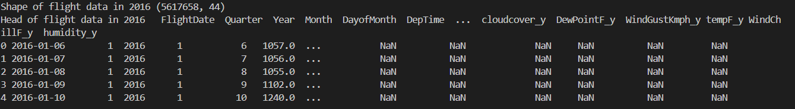
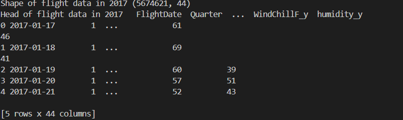

# PetaVue Coding Assigment

According to the problem statement, data need to be merged from two different sources

- **Source 1**: Flight data from two years 2016 and 2017
- **Source 2**: Weather data from two years 2016 and 2017

## How to look at the code:
- file name `data_merger.py` contains the final code for merging the data. 
- Due to low RAM on my local machine, data has been mergerd into two files one for 2016 and another one for 2017.

Shape of data after merging 2016 flight data with 2016 weather data:
Shape looks like this:
```
(5617658, 44)
```
Snapshot of the data looks like this:


Shape of data after merging 2017 flight data with 2017 weather data:
```
(5674621, 44)
```

Snapshot of the data looks like this:


Now these two files can also be concated to get the data in single file using ```pd.concat()``` function.
